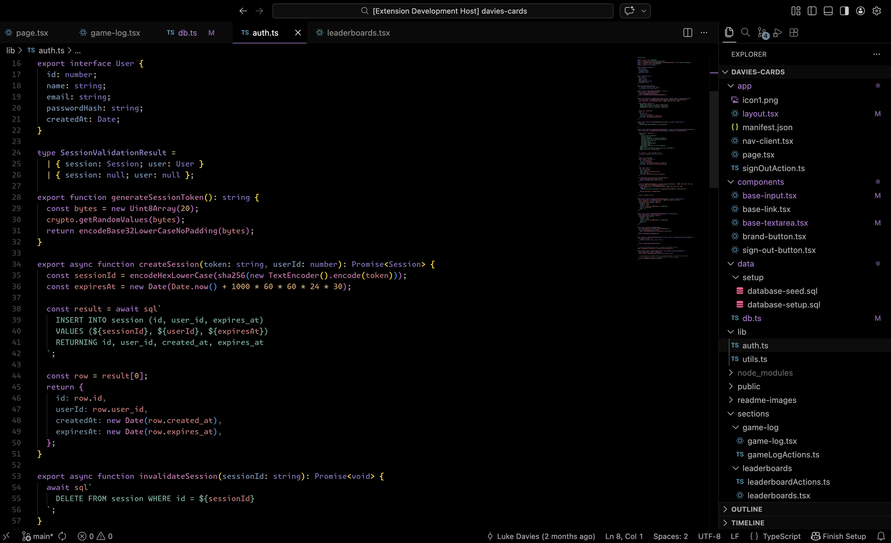
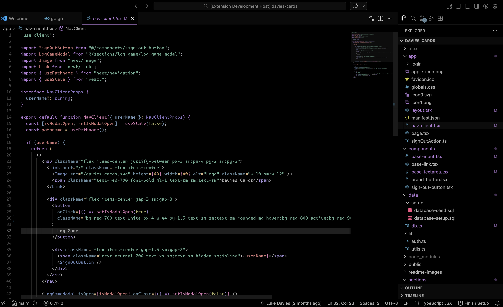

# Spaceland Theme

A Visual Studio Code theme for the wonderers. Fine-tuned for those of us who like to code late into the night and look up at the stars. This theme is great for people who want to get to work with a beautiful space-inspired theme with true black backgrounds for reduced eye strain and OLED-friendly display.

## Demo Images

Javascript

React

## Colors

| Usage           | Palette      | Hex Code                                                            |
| --------------- | ------------ | ------------------------------------------------------------------- |
| Background      | Pure Black   |  `#000000` |
| Comment         | Dark Grey    |  `#888888` |
| Text/Foreground | Light Grey   |  `#cccccc` |
| Function        | Pink         |  `#ff99dd` |
| Variable        | Red          |  `#ff9999` |
| Number          | Orange       |  `#ffcc99` |
| Attribute       | Medium Blue  |  `#99ddff` |
| Keyword         | Key Purple   |  `#dd99ff` |
| String          | Green        |  `#99ffdd` |
| React Component | Blue-Purple  |  `#9999ff` |
| HTML Tag        | Muted Purple |  `#7d7dcc` |
| Constant/Pseudo | Light Green  |  `#ccff99` |
| Support         | Yellow       |  `#ffff99` |
| Operator        | Lion         |  `#f8cfa0` |

## Installation

1.  Install [Visual Studio Code](https://code.visualstudio.com/)
2.  Launch Visual Studio Code
3.  Choose **Extensions** from menu
4.  Search for `spaceland theme`
5.  Click **Install** to install it
6.  Click **Reload** to reload the Code
7.  From the menu bar click: Code > Preferences > Color Theme > **Spaceland Theme**

## Preferences shown in the preview

The font in the preview image is Monaspace Krypton.

The icon theme used in the demo is the dark version of icons from the [City Lights Icon package](https://marketplace.visualstudio.com/items?itemName=Yummygum.city-lights-icon-vsc).

## Misc

This is my first theme, created in high school now redone years later in 2026. If you see something off, please feel free to [file an issue](https://github.com/sdras/night-owl-vscode-theme/issues)!

To make this theme I used [New Moon Syntax Theme](https://marketplace.visualstudio.com/items?itemName=taniarascia.new-moon-vscode) as a starting point, as well as the article [Creating a VS Code Theme](https://css-tricks.com/creating-a-vs-code-theme/).

**Enjoy coding among the stars! Best of luck with your programming endeavors.** ✨🪐👽👾🌃